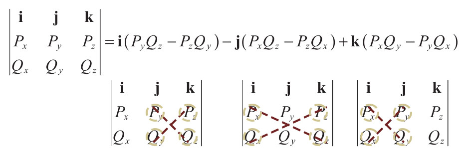

# MathFor3DAndCG
Study notes of Mathematics for `Lengyel, Eric. 3D Game Programming and Computer Graphics. 2011`

# Chapter 2 Vector

## 2.1 Vector Properties

> ​	$n$-dimensional vector $V$:

$$
V = \langle V_1,V_2,...,V_N\rangle
$$

> ​	vector $V$ (**column picture**) represented by a matrix with 1 column and $n$ rows:

$$
V = \begin{bmatrix}V_1\\V_2\\\vdots\\V_n\end{bmatrix}
$$

> ​	vector $V$ (**row picture**) ,the transpose of their corresponding column vectors:

$$
V^T = [V_1\quad V_2\quad \cdots\quad  V_n ]
$$

> ​	scalar($a$) multiply vector($V$):

$$
aV = Va =\langle aV_1, aV_2,..., aV_n\rangle
$$

> ​	vector($P$) + vector($Q$):     (element-wise operation)

$$
P+Q=\langle P_1+Q_1,P_2+Q_2,..., P_n+Q_n\rangle
$$

> ​	 $\norm{V}$ ,**magnitude/norm** of an $n$-dimensional vector $V$ is a **scalar**.

$$
\norm{V} = \sqrt{\sum^{n}_{i=1}{V_i^2}}
$$

> ​	$\norm{V}$ ,is also the **unit length**. A vector having a magnitude/ norm is said to be a **unit vector**.
>
> ​	Taking the 3-dimensional vector as an example, 

$$
\norm{V}=\sqrt{V_x^2+V_y^2+V_z^2}
$$

> ​	**vector normalization**: 
>
> ​		$V$ multiply $\frac{1}{\norm{V}}$

## 2.2 Dot Product

:star: Big picture of its application: it **measure the difference** between the directions in which the two vectors point.

> ​	**dot product** of two vectors, also known as the **scalar product** or **inner product**
>
> ​	Definition: The dot product of two $n$-dimensional vectors $P$ and $Q$, is the **scalar** quantity given by the formula.

$$
P\cdot Q=\sum^{n}_{i=1}P_iQ_i
$$

> ​	dot product is **element-wise** operation

$$
P\cdot Q=P_1\cdot Q_1+P_2\cdot Q_2+...+P_n\cdot Q_n
$$

> ​	dot product represented in matrix format
>
> ​	tips: row vector * column vector = scalar

$$
P^T\cdot Q=[P_1\quad P_2\quad...\quad P_n]\begin{bmatrix}Q_1\\Q_2\\\vdots\\Q_n\end{bmatrix}
$$

> ​	:star:**Theorem**: Given two $n$-dimensional vectors $P$ and $Q$, the dot product $P\cdot Q$ satisfies the equation. $a$ is the angle between $P$ and $Q$.

$$
P\cdot Q = \norm{P}\norm{Q}\cos{a}
$$

> ​	:pushpin: **Fact**:  in light of theorem: if two vector $P\cdot Q=0$, they are **orthogonal**.

> ​	:pushpin: **Fact**:  $P\cdot Q>0$, they are **on the same side**.  $P\cdot Q<0$, they are **on the opposite side**.

> ​	:star: **Theorem**: Given any scalar $a$ and any three vectors $P, Q$, and $R$, the following properties hold.

$$
\begin{align}
P\cdot Q&= Q\cdot P \\
(aP)\cdot Q&=a(P\cdot Q)\\
P\cdot(Q+R)&= P\cdot Q+ P\cdot R\\
P\cdot P&=\norm{P}^2\\
|P\cdot Q|&\leq \norm{P}\norm{Q}
\end{align}
$$

## 2.3 Cross Product

:star: Big Picture: **calculates surface normal** at a particular point given two distinct tangent vectors.

> ​	**cross product** is also known as **vector product** which **returns a vector** rather than an scalar.

> ​	**Definition** 2.6. The cross product of two 3D vectors $P$ and $Q$, written as $P\cross Q$, is a vector quantity given by the formula

$$
P\cross Q = \langle P_yQ_z-P_zQ_y,\space P_zQ_x-P_xQ_z,\space P_xQ_y-P_yQ_x\rangle
$$

> ​	cross product in **matrix picture**(also known as **pseudodeterminant**), where $i,j,k$ are unit vector:

$$
P\cross Q = 
\begin{vmatrix}
\bold{i}&\bold{j}&\bold{k}\\
P_x&P_y&P_z\\
Q_x&Q_y&Q_z
\end{vmatrix}\\\\
i=\langle1,0,0\rangle\\
j=\langle0,1,0\rangle\\
k=\langle0,0,1\rangle\\
$$

> ​	:star:**Theorem 2.7.** Let $P$ and $Q$ be any two 3D vectors. Then:

$$
(P\cross Q)\cdot P=0\\(P\cross Q)\cdot Q=0
$$

This is very easy to understand. The dot product between a vector and its *orthogonal complement* is **ZERO** because they have nothing aligned.

> ​	:star: **Theorem 2.8.** Given two 3D vectors $P$ and $Q$, the cross product $P\cross Q$ satisfies the equation. where $a$ is  the **planar angle** between the lines connecting the origin to the points represented by $P$ and $Q$.

$$
\norm{P\cross Q}=\norm{P}\norm{Q}\sin{a}
$$

