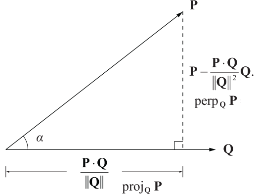
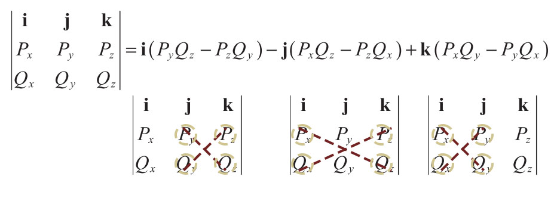
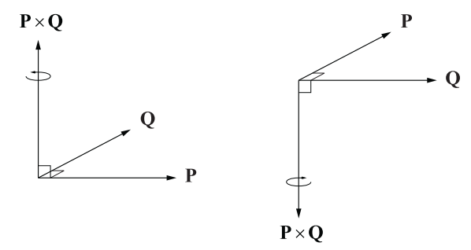
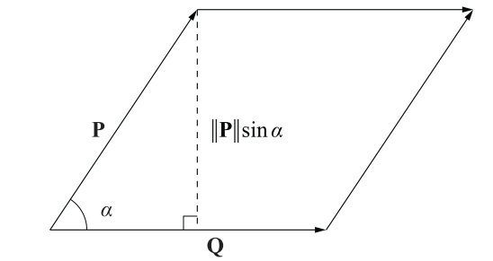

# MathFor3DAndCG
Study notes of Mathematics for `Lengyel, Eric. 3D Game Programming and Computer Graphics. 2011`


# Quick Reference

## 2. Vector

:pushpin:**Dot Products**
The dot product between two $n$-dimensional vectors $P$ and $Q$ is a **scalar** defined by
$$
P\cdot Q=\sum_{i=1}^{n}P_iQ_i=P_1\cdot Q_1+P_2\cdot Q_2+...+P_n\cdot Q_n
$$
The dot product is related to the **angle** $a$ between the vectors $P$ and $Q$ by the formula
$$
P\cdot Q = \norm{P}\norm{Q}\cos{a}
$$


:pushpin:**Vector Projections**

The **projection** of a vector $P$ onto a vector $Q$ is given by
$$
\text{proj}_QP = \frac{P\cdot Q}{\norm{Q}^2}Q
$$
and the component of $P$ that is **perpendicular** to $Q$ is given by
$$
\text{perp}_QP &= P-\text{proj}_QP\\
&=P-\frac{P\cdot Q}{\norm{Q}^2}Q
$$


:pushpin:**Cross Products**

The cross product between two 3D vectors $P$ and $Q $is a 3D vector defined by
$$
P\cross Q = \langle P_yQ_z-P_zQ_y,\space P_zQ_x-P_xQ_z,\space P_xQ_y-P_yQ_x\rangle
$$
This can also be written as the **matrix-vector product**
$$
P\cross Q=
\begin{bmatrix}
0&-P_z&P_y\\
P_z&0&-P_x\\
-P_y&P_x&0
\end{bmatrix}
\begin{bmatrix}
Q_x\\Q_y\\Q_z
\end{bmatrix}
$$
The **magnitude** of the cross product is related to the **angle** $a$ between the vectors $P$ and $Q$ by the formula
$$
\norm{P\cross Q}=\norm{P}\norm{Q}\sin{a}
$$


:pushpin:**Gram-Schmidt Orthogonalization**

A basis $\Beta=\{e_1,e_2,...,e_n\}$ for an $n$-dimensional vector space can be orthogonalized by constructing a new set of vectors $\Beta'=\{e_1',e_2',...,e_n'\}$ using the formula
$$
e_i'=e_i-\sum_{k=1}^{i-1}\frac{e_i\cdot e_k'}{e_k'^2}e_k'
$$


# Chapter 2 Vector

## 2.1 Vector Properties

> ​	$n$-dimensional vector $V$:

$$
V = \langle V_1,V_2,...,V_N\rangle
$$


> ​	vector $V$ (**column picture**) represented by a matrix with 1 column and $n$ rows:

$$
V = \begin{bmatrix}V_1\\V_2\\\vdots\\V_n\end{bmatrix}
$$


> ​	vector $V$ (**row picture**) ,the transpose of their corresponding column vectors:

$$
V^T = [V_1\quad V_2\quad \cdots\quad  V_n ]
$$


> ​	scalar($a$) multiply vector($V$):

$$
aV = Va =\langle aV_1, aV_2,..., aV_n\rangle
$$


> ​	vector($P$) + vector($Q$):     (element-wise operation)

$$
P+Q=\langle P_1+Q_1,P_2+Q_2,..., P_n+Q_n\rangle
$$


> ​	 $\norm{V}$ ,**magnitude/norm** of an $n$-dimensional vector $V$ is a **scalar**.

$$
\norm{V} = \sqrt{\sum^{n}_{i=1}{V_i^2}}
$$


> ​	$\norm{V}$ ,is also the **unit length**. A vector having a magnitude/ norm is said to be a **unit vector**.
>
> ​	Taking the 3-dimensional vector as an example, 

$$
\norm{V}=\sqrt{V_x^2+V_y^2+V_z^2}
$$


> ​	**vector normalization**: 
>
> ​		$V$ multiply $\frac{1}{\norm{V}}$


## 2.2 Dot Product

:star: Big picture of its application: it **measure the difference** between the directions in which the two vectors point.

> ​	**dot product** of two vectors, also known as the **scalar product** or **inner product**
>
> ​	Definition: The dot product of two $n$-dimensional vectors $P$ and $Q$, is the **scalar** quantity given by the formula.

$$
P\cdot Q=\sum^{n}_{i=1}P_iQ_i
$$

> ​	dot product is **element-wise** operation

$$
P\cdot Q=P_1\cdot Q_1+P_2\cdot Q_2+...+P_n\cdot Q_n
$$

> ​	dot product represented in matrix format
>
> ​	tips: row vector * column vector = scalar

$$
P^T\cdot Q=[P_1\quad P_2\quad...\quad P_n]\begin{bmatrix}Q_1\\Q_2\\\vdots\\Q_n\end{bmatrix}
$$


> ​	:star:**Theorem**: Given two $n$-dimensional vectors $P$ and $Q$, the dot product $P\cdot Q$ satisfies the equation. $a$ is the angle between $P$ and $Q$.

$$
P\cdot Q = \norm{P}\norm{Q}\cos{a}
$$

> ​	:pushpin: **Fact**:  in light of theorem: if two vector $P\cdot Q=0$, they are **orthogonal**.

> ​	:pushpin: **Fact**:  $P\cdot Q>0$, they are **on the same side**.  $P\cdot Q<0$, they are **on the opposite side**.


> ​	:star: **Theorem**: Given any scalar $a$ and any three vectors $P, Q$, and $R$, the following properties hold.

$$
\begin{align}
P\cdot Q&= Q\cdot P \\
(aP)\cdot Q&=a(P\cdot Q)\\
P\cdot(Q+R)&= P\cdot Q+ P\cdot R\\
P\cdot P&=\norm{P}^2\\
|P\cdot Q|&\leq \norm{P}\norm{Q}
\end{align}
$$


> ​	:pushpin: **Projection**: for a vector $P$ projected onto $Q$ can be denoted as
>
> ​	:pushpin:**Perpendicular**: the projection perpendicular to original vector

$$
\begin{align}
\text{proj}_QP &= \frac{P\cdot Q}{\norm{Q}^2}Q\\\\
\text{perp}_QP &= P-\text{proj}_QP\\
&=P-\frac{P\cdot Q}{\norm{Q}^2}Q
\end{align}
$$




## 2.3 Cross Product

:star: Big Picture: **calculates surface normal** at a particular point given two distinct tangent vectors.

> ​	**cross product** is also known as **vector product** which **returns a vector** rather than an scalar.


> ​	**Definition** 2.6. The cross product of two 3D vectors $P$ and $Q$, written as $P\cross Q$, is a vector quantity given by the formula

$$
P\cross Q = \langle P_yQ_z-P_zQ_y,\space P_zQ_x-P_xQ_z,\space P_xQ_y-P_yQ_x\rangle
$$

> ​	cross product in **matrix picture**(also known as **pseudodeterminant**), where $i,j,k$ are unit vector:

$$
P\cross Q = 
\begin{vmatrix}
\bold{i}&\bold{j}&\bold{k}\\
P_x&P_y&P_z\\
Q_x&Q_y&Q_z
\end{vmatrix}\\\\
i=\langle1,0,0\rangle\\
j=\langle0,1,0\rangle\\
k=\langle0,0,1\rangle\\
$$



:bangbang: **Attention:** the sign in front of $j$ is **negative**! Others are positive.


> ​	:star:**Theorem 2.7.** Let $P$ and $Q$ be any two 3D vectors. Then:

$$
(P\cross Q)\cdot P=0\\(P\cross Q)\cdot Q=0
$$


This is very easy to understand. The dot product between a vector and its *orthogonal complement* is **ZERO** because they have nothing aligned.


> ​	:star: **Theorem 2.8.** Given two 3D vectors $P$ and $Q$, the cross product $P\cross Q$ satisfies the equation. where $a$ is  the **planar angle** between the lines connecting the origin to the points represented by $P$ and $Q$.

$$
\norm{P\cross Q}=\norm{P}\norm{Q}\sin{a}
$$

> ​	:pushpin:**Right hand rule**: The cross product is with orientation.



> ​	:star: **Area of cross product**: it is the **parallelogram** formed by $P$ and $Q$.

$$
\text{Area} = \norm{Q}\cdot\norm{P}\sin{a}=\text{base}\cross\text{height}=P\cross Q
$$





> ​	:star: **Theorem 2.9.** Given any two scalars $a$ and $b$, and any three 3D vectors $P$, $Q$, and $R$, the following properties hold.

$$
Q\cross P = -(P\cross Q)\\
(aP)\cross Q = a(P\cross Q)\\
P\cross(Q+R)=P\cross Q+P\cross R\\
P\cross P = 0 = \langle0,0,0\rangle\\
(P\cross Q)\cdot R = (R\cross P)\cdot Q = (Q\cross R)\cdot P\\
P\cross(Q\cross P) = P\cross Q\cross P = P^2Q - (P\cdot Q)P
$$


> ​	:pushpin: **Anticommutative**, is a characteristic of cross product which implies the **order** of cross product matters.

$$
(P\cross Q)\cross R \neq P\cross (Q\cross R)
$$


## 2.4 Vector Space

> ​	:star: **Definition 2.10.** A vector space is a set $V$, whose elements are called vectors, for which addition and scalar multiplication are defined, and the following properties hold.

- $P\in V,\space Q\in V, \quad \text{s.t.  }P+Q\in V$
- $P\in V, a\in \mathbb{R}, \text{  s.t.  }aP\in V$
- $\exist\space 0\in V, \text{s.t.}\quad\ P+0=P$.
- $\exist\space Q\in V, \text{s.t.}\quad\ P+Q=0$.
- $(P+Q)+R=P+(Q+R)$
-  $(ab)P=a(bP)$
- $a(P+Q)=aP+aQ$
- $(a+b)P = aP+bP$


> ​	:star:**Definition 2.11.** A set of $n$ vectors  $\{e_1,e_2,...,e_n\}$ is **linearly independent** if there **do not exist** real number $a_1,a_2,...,a_n$ where at least one of the $a_i$ is not zero, such that

$$
a_1e_1+a_2e_2+\cdots+a_ne_n=0
$$

> ​	otherwise, the set $\{e_1,e_2,...,e_n\}$ is called **linearly dependent.**


> ​	:star:**Definition 2.13.** A basis $\Beta=\{e_1,e_2,...,e_n\}$ for a vector space is called orthogonal if for every pair $(i,j)$ with $i\neq j$, we have:

$$
e_i\cdot e_j=0
$$


> ​	:star:**Theorem 2.14.** Given two nonzero vectors $e_1$ and $e_2$ , if $e_1\cdot e_2=0$ , then $e_1$ and $e_2$ are **linearly independent**。
>
> which is very easy to understand since they have nothing overlapped.


> ​	**Definition 2.15.** A basis $\Beta=\{e_1,e_2,...,e_n\}$ for a vector space is called **orthonormal** if for every pair $(i,j)$ we have $$

$$
\begin{align}
e_i\cdot e_j=\delta_{ij}\\
\delta_{ij}=
\begin{cases}
1,\text{ if }i=j\\0,\text{ if }i\neq j
\end{cases}
\end{align}
$$

where $\delta_{ij}$ is called **Kronecker delta**. 


> ​	:computer:**Algorithm 2.16.** Gram-Schmidt Orthogonalization. Given a set of $n$ linearly independent vectors $\Beta=\{e_1,e_2,...,e_n\}$, this algorithm produces a set $\Beta'=\{e_1',e_2',...,e_n'\}$ such that

$$
e_i'\cdot e_j'=0, \text{whenever }i\neq j
$$

- A. set $e_1'=e_1$
- B. Begin with index $i=2$
- C. Subtract the projection of $e_i$ onto the vector $e_1',e_2',...,e_{i-1}'$ from $e_i$ and store the result in $e_i'$. That is

$$
e_i'=e_i-\sum_{k=1}^{i-1}\frac{e_i\cdot e_k'}{e_k'^2}e_k'
$$

- D. If $i<n$, $i++$, back to step C.

:star:Big picture of Gram-Schmidt Orthogonalization: it **alternates coordinate systems.**


# Chapter 3 Matrices

:star: **Big picture**: It means to cover calculation between different Cartesian coordinate spaces.

## 3.1 Matrix Properties

> ​	**Basic representation** of a matrix:

$$
M_{ij} = \begin{bmatrix}
F_{11}&F_{12}&F_{13}&F_{14}\\
F_{21}&F_{22}&F_{23}&F_{24}\\
F_{31}&F_{32}&F_{33}&F_{34}\\
\end{bmatrix}
$$

where $i$ and $j$ represents **$i$-th row of the $j$-th column**. In this case, $i=3,j=4$


> ​	**Transpose** of a matrix:

$$
M_{ij}^T = 
\begin{bmatrix}
F_{11}&F_{21}&F_{31}\\
F_{12}&F_{22}&F_{32}\\
F_{13}&F_{23}&F_{33}\\
F_{14}&F_{24}&F_{34}\\
\end{bmatrix}
$$


> ​	:star:**Matrix multiplication**: suppose 2 matrices $F$($n\cross m_1$) and $G(m_2\cross p)$, **the prerequisite for a valid matrix multiplication is** that $m_1=m_2$. The shape of output matrix is $n\cross p$. The $i,j$ element of the matrix is:

$$
(FG)_{ij} = \sum_{k=1}^{m}F_{ik}G_{kj}
$$

> ​	:bulb: Another picture of this: the $(i,j)$ entry of $FG$ is equal to the **dot product of the $i$-th row of $F$ and the $j$-th column of $G$**. e.g.

```python
>>> import numpy as np
>>> F = np.array([[2,3,1],
                  [3,0,1]])
>>> G = np.array([[1,2],
                  [4,0],
                  [3,2]])
>>> F@G
array([[17,  6],
       [ 6,  8]])
```

The `2,2` element of output matrix is the dot product of $2$-th row of $F$ and $2$-th colomn of $G$ 
$$
M_{22}=\begin{bmatrix}3&0&1\end{bmatrix}\begin{bmatrix}2\\0\\2\end{bmatrix}
$$

> ​	**Theorem 3.1.** Given any two scalars a and b and any three nm× matrices F, G, and H, the following properties hold.

$$
F+G=G+F\\
(F+G)+H = F+(G+H)\\
a(bF)=(ab)F\\
a(F+G) = aF+aG\\
(a+b)F = aF+bF
$$


> ​	**Theorem 3.2.** Given any scalar $a$, an $n\cross m$ matrix $F$, an $m\cross p$ matrix $G$, and a $p\cross q$ matrix $H$, the following properties hold.

$$
(aF)G = a(FG)\\
(FG)H = F(GH)\\
(FG)^T = G^TF^T
$$


## 3.2 Linear Systems


# Notation Convention

| Quantity/Operation | Notation/Examples                          |
| ------------------ | ------------------------------------------ |
| Scalars            | Italic letters: $x,t,A,a,\omega$           |
| Angles             | Italic Greek letters: $\theta,\phi,a$      |
| Vectors            | Boldface letters: $\bold{V, P, x, \omega}$ |
| Quaternions        | Boldface letters: $\bold{q_1, q , q_2}$    |
| Matrices           | Boldface letters: $\bold{M,P}$             |
|                    |                                            |
|                    |                                            |
|                    |                                            |
|                    |                                            |


